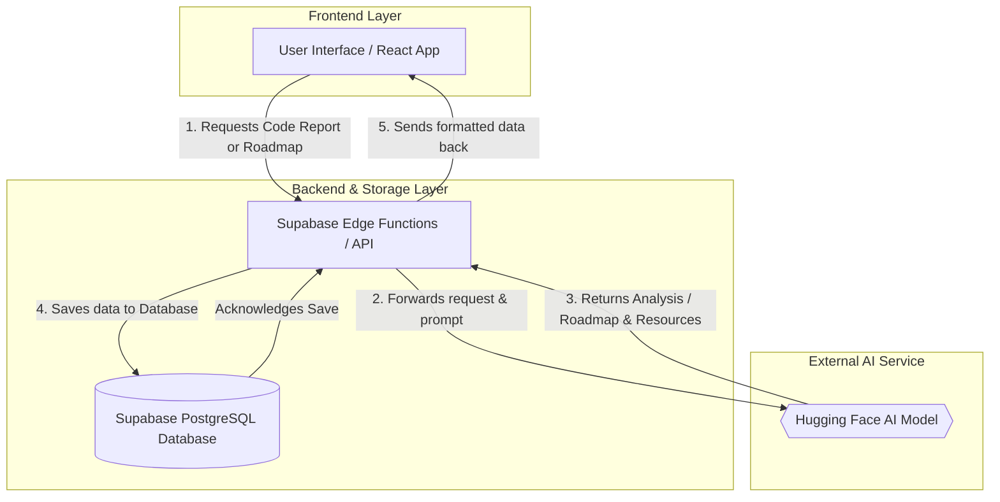
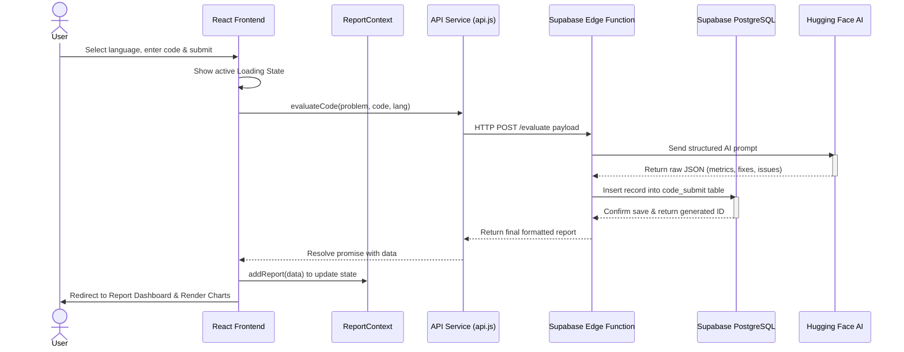
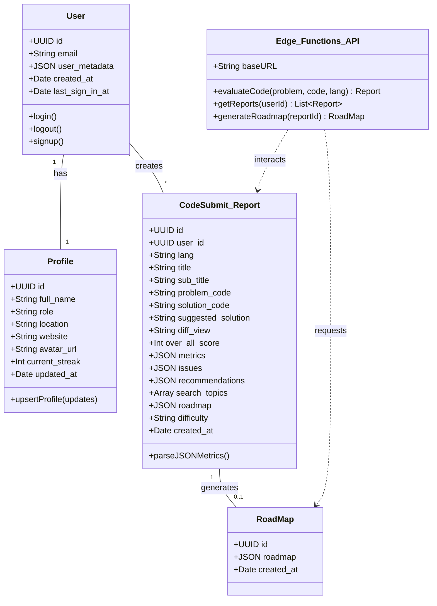
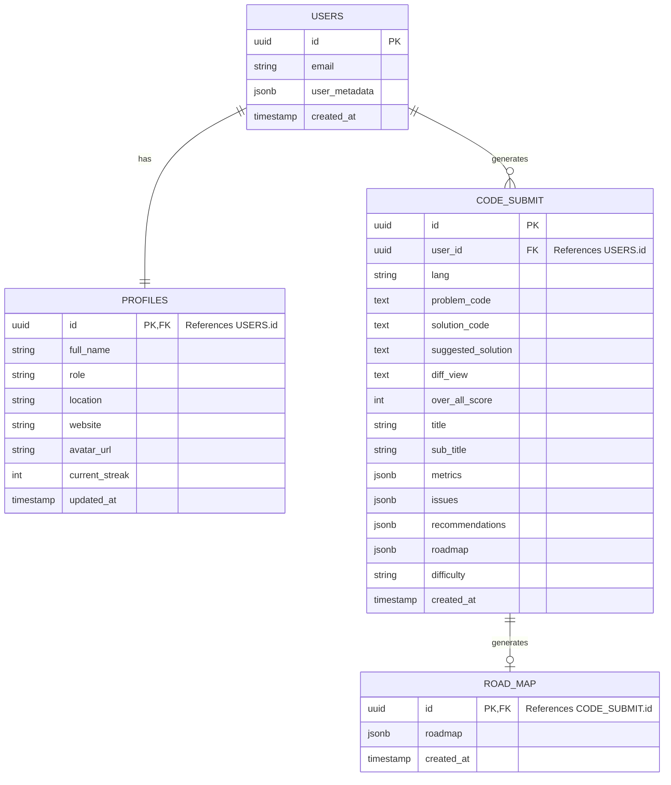
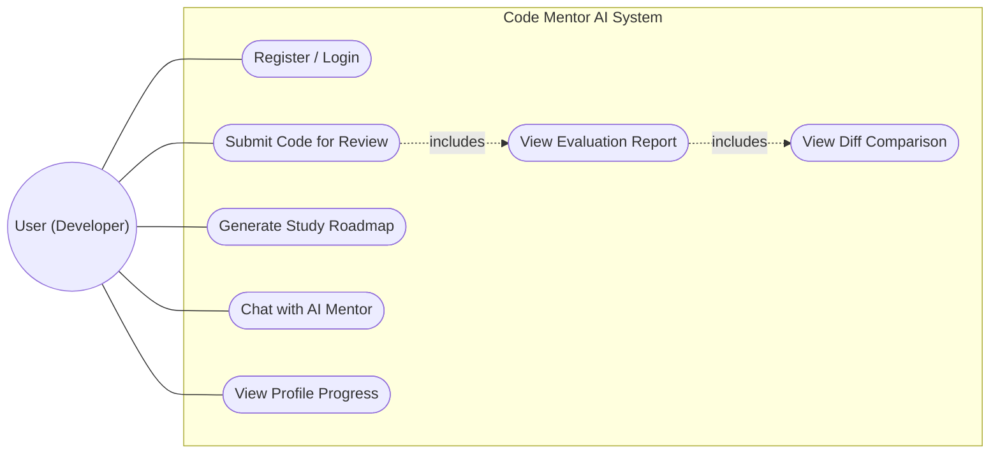

# Analysis and Design: Code Mentor AI

## 1. Introduction
The Analysis and Design phase of the **Code Mentor AI** project serves as the foundational blueprint for developing an intelligent, autonomous platform that provides real-time, expert-level code reviews. The primary objective is to address the critical shortage of senior developers available to mentor junior programmers. By bridging this gap using Large Language Models (LLMs), the platform ensures that novice developers can receive immediate, structured feedback on their code. This document outlines the comprehensive architectural and functional plans, detailing how the system utilizes a modern technology stack—including React.js, Tailwind CSS, and a serverless Supabase backend (Edge Functions and PostgreSQL)—to deliver a secure, resilient, and highly interactive educational experience.

## 2. Requirement Determination
The requirements for the Code Mentor AI platform were determined by closely analyzing the common pain points experienced by junior developers, computer science students, and boot-camp graduates. The core problem identified is that while junior developers write functional code, it often lacks efficiency, has poor readability, and misses critical edge cases. Traditional linters only catch syntax errors, and human mentorship is scarce. 

To resolve this, the system's requirements were driven by the need for:
- **Instantaneous Mentorship:** The need to evaluate code within seconds rather than waiting days for human feedback.
- **Actionable Visual Feedback:** The necessity to translate raw AI evaluations into easily digestible visual components, avoiding cognitive overload.
- **System Resilience:** Addressing the inherent unpredictability of LLMs (such as rate limits and inconsistent JSON outputs) required defensive engineering practices like exponential network backoff and resilient data parsing.
- **Progress Tracking:** The need to monitor educational growth over time to maintain user motivation.

## 2.3 Stakeholders
The successful implementation and operation of the Code Mentor AI platform impact multiple groups. The primary stakeholders include:
- **Junior Developers and Students:** The primary end-users who utilize the platform to receive immediate, structured code reviews, track their learning progress, and avoid accumulating technical debt.
- **Educational Institutions:** Universities, coding boot-camps, and teaching assistants who can leverage the platform to automatically grade student assignments and provide standardized, high-quality feedback.
- **Tech Companies and Recruiters:** Organizations that can utilize the system for onboarding new hires to specific coding conventions or screening candidates during technical interviews.
- **Senior Developers:** Indirect beneficiaries whose workload is significantly reduced, as the AI handles the repetitive task of reviewing basic syntax, logic, and efficiency issues.

## 2.4 System Design
The system architecture of Code Mentor AI follows a decoupled Client-Server model integrated with a Serverless backend to ensure high scalability and security:
- **Architecture Pattern:** The platform employs a Serverless architecture. The frontend acts as a robust Single Page Application (SPA), while the backend relies on on-demand edge functions rather than a continuous server.
- **Frontend Layer (Presentation):** Built using **React.js** (Component-based architecture) and bundled with **Vite** for rapid Hot Module Replacement (HMR). The user interface is styled using **Tailwind CSS** for responsive design, incorporating **Framer Motion** for dynamic interactions and **Recharts** for data visualization (e.g., Radar charts). Navigation is handled via `react-router-dom`.
- **Backend/API Layer (Logic & Integration):** The backend utilizes **Supabase Edge Functions**. These serverless functions act as a secure API Gateway that receives the frontend payload, communicates securely with the external Large Language Model (LLM) API (shielding the API keys from the client-side), and formats the AI's response before sending it back.
- **Data Layer (Storage):** **Supabase PostgreSQL** is used as the primary persistent storage. It handles secure user authentication (`AuthContext`), and stores historical data including user credentials, evaluation reports, and profile statistics (streaks, mastered languages).
- **Component & Utility Design:** The codebase is modularly designed with a clear separation of concerns. UI components (Dashboards, Chat, Submission forms) reside in `src/pages` and `src/components`, while business logic and API calls are isolated in `src/services/api.js`. Resiliency logic, such as data parsing and network retries, is abstracted into `src/utils/reportUtils.js` and `src/utils/apiRetry.js`.

## 2.5 Block Diagram
The following block diagram illustrates the core data flow of the platform. When a user requests a code report or an educational roadmap, the data is sent to the backend. The backend then communicates with the Hugging Face AI model to generate the necessary resources and roadmap. Once the AI returns the generated content, the backend saves it persistently in the database before returning the finalized data to be displayed to the user on the frontend.

### 2.5.1 Sequence Diagram (Code Submission Flow)
The sequence diagram details the exact chronological steps taken when a user submits their code for evaluation, showing the synchronous and asynchronous interactions between the frontend, the serverless backend, the external AI, and the database.

## 2.6 Class Diagram
Although built primarily with React functional components and a serverless backend, the system's core entities and data models can be visualized through a class diagram. This diagram illustrates the relationships between the User, their Profile, the generated Reports, the Roadmaps, and the core API Service responsible for interacting with the AI.

## 2.7 Database Design
The Code Mentor AI platform leverages **Supabase (PostgreSQL)** for secure, relational data storage. The database schema is designed to efficiently store user metrics, generated AI reports, and educational roadmaps, with strict Foreign Key constraints linking all data back to the authenticated user.

## 2.8 Use Cases
The system is designed around the needs of the primary actor—the User (Junior Developer/Student). The following outlines the major interactions the actor has with the platform:

1. **Register / Login:** The user authenticates securely via the Supabase Auth system to maintain session privacy and save historical data.
2. **Submit Code for Review:** The user selects a programming language, inputs the problem description, and provides their code solution for AI evaluation.
3. **View Code Evaluation Report:** After processing, the user views a detailed report including overall scores, metric-specific breakdowns (efficiency, readability), and categorized issues.
4. **View Diff Comparison:** The user compares their original submitted code side-by-side with the AI-optimized solution.
5. **Generate Study Roadmap:** The user requests a tailored educational roadmap by specifying a topic and difficulty level.
6. **Chat with AI Mentor:** The user interacts with the AI in a chat interface to ask specific technical questions about their code or general programming concepts.
7. **View Profile Progress:** The user accesses their profile to monitor their continuous learning streaks, total reviews conducted, and programming languages mastered.

### Use Case Diagram
The diagram below illustrates the actor's primary interactions with the system's core features.

### Detailed Use Case Specifications

**UC-01: User Registration and Login**
- **Primary Actor:** User (Developer/Student)
- **Pre-conditions:** The user accesses the application's landing or authentication page.
- **Main Success Scenario:**
  1. The user navigates to the Auth page.
  2. The user inputs their email and password.
  3. The system authenticates the credentials via Supabase Auth.
  4. The system establishes a secure session and redirects the user to the main Dashboard.
- **Alternative Flow:** Invalid credentials entered; the system displays an error message prompting retry.
- **Post-conditions:** The user is authenticated and can access protected routes.

**UC-02: Submit Code for Review**
- **Primary Actor:** Authenticated User
- **Pre-conditions:** The user is logged in and navigates to the code submission interface.
- **Main Success Scenario:**
  1. The user selects the programming language from a provided list.
  2. The user types or pastes the problem description and their code solution.
  3. The user submits the form.
  4. The system displays a loading state while the backend proxy communicates with the AI model.
  5. The backend stores the AI's response in the PostgreSQL database.
  6. The system transitions to the detailed report view.
- **Alternative Flow:** AI API rate limit reached; the system's exponential backoff mechanism retries the request silently before notifying the user if it ultimately fails.
- **Post-conditions:** A comprehensive evaluation report is generated, persistently saved, and linked to the user's profile.

**UC-03: View Evaluation Report and Diff Comparison**
- **Primary Actor:** Authenticated User
- **Pre-conditions:** The user has just submitted code or opened a historical report from their Profile.
- **Main Success Scenario:**
  1. The system renders the overall score and metric-specific breakdowns using interactive charts (e.g., Radar charts).
  2. The system displays a categorized list of issues (Critical, Major, Minor).
  3. The user activates the "Diff View".
  4. The system presents a side-by-side highlighting of differences between the user's original code and the AI's optimized solution.
- **Post-conditions:** The user receives actionable feedback to improve their coding skills.

**UC-04: Generate Educational Roadmap**
- **Primary Actor:** Authenticated User
- **Pre-conditions:** The user is logged in and on the Roadmap generator page.
- **Main Success Scenario:**
  1. The user inputs a learning topic (e.g., "React Hooks") and selects a difficulty level (e.g., "Intermediate").
  2. The user submits the request.
  3. The system fetches a structured learning path from the AI.
  4. The system displays sequential modules, topics, and recommended resources.
- **Post-conditions:** A personalized study plan is created and stored for future reference.

## 3. User Requirements
User requirements define what the end-users must be able to achieve while interacting with the platform. For the Code Mentor AI platform, users require the ability to:
- **Secure Authentication:** Users must be able to securely register, log in, and maintain a private session to ensure their code submissions and evaluations remain confidential.
- **Code Submission Interface:** Users must have a dedicated workspace to select their target programming language (e.g., C++, Python, JavaScript), input a problem description, and paste their code solution.
- **Detailed Evaluation Reviews:** Upon submission, users need to view a comprehensive breakdown of their code's quality. This includes an overall score out of 100, categorized performance (e.g., "Excellent", "Needs Improvement"), and a list of specific issues categorized by severity (Critical, Major, Minor).
- **Comparative Code Analysis:** Users must be able to view a side-by-side "Diff View" that clearly highlights the differences between their original submission and the AI's optimized solution.
- **Progress Tracking and Gamification:** Users require a centralized profile page to view their historical submissions, monitor continuous learning streaks, unlock achievements, and see the programming languages they have mastered.
- **Interactive Assistance:** Users must be able to utilize a chat interface to ask the AI further questions about complex code snippets and access a personalized educational roadmap tailored to their skill level.

## 4. System Requirements
System requirements outline the necessary technological infrastructure and environments needed for the platform to function optimally:
- **Frontend Environment:** A modern web browser (e.g., Chrome, Firefox, Safari) capable of rendering React 19 applications, handling dynamic DOM manipulations, and rendering complex UI components (such as Framer Motion animations and Recharts graphs).
- **Backend Infrastructure:** A serverless architecture utilizing Supabase Edge Functions to securely proxy requests between the frontend client and the external LLM provider, ensuring API keys are never exposed in the browser.
- **Database Architecture:** A PostgreSQL database managed by Supabase to persistently store user credentials, authentication tokens, historical evaluation reports, and user profile statistics.
- **AI/LLM Engine:** Continuous, low-latency access to a Generative AI API capable of understanding deep code context, syntax analysis, and algorithmic complexity evaluation across multiple programming languages.
- **Hosting and Deployment:** A continuous deployment pipeline hosted on reliable platforms (such as GitHub Pages or Vercel) to deliver static assets fast and securely.

## 5. Functional Requirements
Functional requirements detail the specific behaviors, processes, and data handling the system must perform:
- **Authentication Module (`AuthContext` & `Auth.jsx`):** The system must facilitate secure user signup and login using Supabase Auth. It must enforce protected routes, instantly redirecting unauthenticated users away from the dashboard back to the login page.
- **Submission Module (`Submit.jsx`):** The system must accept user inputs (Problem Description, Code Solution, Programming Language) and send this payload securely via HTTP POST to the backend evaluation API (`/evaluate`).
- **Evaluation Engine (`api.js`):** The system must instruct the LLM to grade the code across specific, predefined software engineering metrics: Readability, Efficiency, Problem Solving, Correctness, and Edge Cases.
- **Report Parsing and Generation (`reportUtils.js` & `Reports.jsx`):** The system must defensively parse the AI's JSON response, accommodating potential key naming variations (e.g., checking for `problem_solving`, `problemSolving`, or `logic`). It must then dynamically render Radar charts and a side-by-side Diff View component.
- **Profile and State Management (`Profile.jsx`):** The system must aggregate user statistics by fetching historical reports (`getReports`), calculating consecutive learning streaks, incrementing the total projects reviewed, and updating mastered languages.
- **Interactive Features (`Chat.jsx` & `Roadmap.jsx`):** The system must support real-time chat sessions that retain conversational context about previous code submissions, and generate step-by-step study plans.

## 6. Non-Functional Requirements
Non-functional requirements dictate the performance standards, security, and usability characteristics of the system:
- **Performance & Latency:** The system must process code evaluations and return the completed report within an acceptable window of 5 to 15 seconds (averaging 6-8 seconds), managing user expectations via active loading states.
- **Reliability and Fault Tolerance (`apiRetry.js`):** The system must implement an automatic retry mechanism utilizing exponential backoff (e.g., retrying after 2s, then 4s) to silently handle temporary API rate limits (HTTP 429) or network timeouts without throwing fatal frontend errors.
- **Usability and Aesthetics:** The frontend must utilize Tailwind CSS to provide a highly responsive, modern, and intuitive user interface. It must include syntax highlighting for code snippets and visually distinct charts to prevent cognitive overload.
- **Security:** The system must strictly adhere to the principle of least privilege. External AI API keys must be isolated within backend Edge Functions. User data and submission history must be isolated per user using Supabase Row Level Security (RLS).
- **Maintainability:** The codebase must be highly modular, separating UI components from API services (`services/api.js`) and utility functions (`utils/reportUtils.js`), ensuring easy integration of future features like IDE extensions or GitHub webhooks.

## 7. Technology Stack
The platform leverages a modern, decoupled architecture to ensure high performance, security, and scalability. Below is the comprehensive list of technologies and tools used throughout the project:

### 7.1 Frontend Technologies (Client-Side)
- **React.js (v19):** The core library used to build the user interface using a component-based architecture.
- **Vite:** A modern build tool and bundler that provides extremely fast Hot Module Replacement (HMR) for a smooth development experience.
- **JavaScript (ES6+):** The primary programming language used for writing application logic.
- **React Router DOM:** Used to handle page navigation and routing, enabling a seamless Single Page Application (SPA) experience.
- **React Context API:** Used for global state management (e.g., handling User Authentication, Reports, and Notifications) without the need for external libraries like Redux.

### 7.2 UI, Styling & Visualization
- **Tailwind CSS:** A utility-first CSS framework used for rapid, responsive, and highly customizable UI design.
- **Framer Motion:** A powerful animation library used to create smooth, dynamic page transitions and interactive micro-animations.
- **Recharts:** A charting library used to render data visualizations, specifically the interactive Radar Charts for code evaluation metrics.
- **Lucide React & React Icons:** Used to provide high-quality, scalable SVG icons throughout the interface.
- **Clsx & Tailwind-merge:** Utility tools used to dynamically merge and construct CSS classes without styling conflicts.

### 7.3 Backend & Infrastructure (Serverless)
- **Supabase (Backend-as-a-Service):** A comprehensive platform utilized for multiple core functions:
  - **Supabase Auth:** Manages secure user authentication, registration, and session token handling.
  - **PostgreSQL:** The robust relational database used to persistently store user profiles, historical code reports, and generated roadmaps.
  - **Edge Functions:** Serverless functions acting as a secure API Gateway/Proxy. They facilitate communication with the external AI model, ensuring API keys are never exposed to the client-side browser.

### 7.4 Artificial Intelligence (AI)
- **Hugging Face API:** The provider for the Large Language Model (LLM) utilized as the core "AI Mentor." It is responsible for analyzing syntax, evaluating algorithmic efficiency, extracting bugs, proposing optimized code, and generating structured learning roadmaps.

### 7.5 Dev Tools & Deployment
- **ESLint:** Used for code linting to identify bugs and enforce consistent coding standards across the project.
- **Vercel / GitHub Pages:** Hosting platforms used for Continuous Integration/Continuous Deployment (CI/CD), ensuring the application is deployed quickly and securely to the web.
