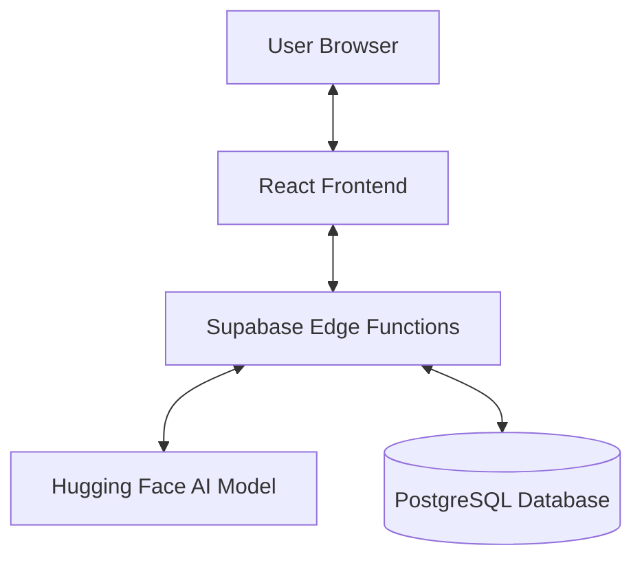

# 🚀 Code Mentor AI - Intelligent Autonomous Code Reviewer

Code Mentor AI is a state-of-the-art platform designed to bridge the gap between junior developers and expert-level mentorship. Built with a modern tech stack and powered by Large Language Models (LLMs), it provides instantaneous, structured, and actionable feedback on code snippets across multiple programming languages.

---

## ✨ Features

- **🤖 AI-Powered Analysis**: Instant grading across critical metrics: Readability, Efficiency, Problem Solving, Correctness, and Edge Cases.
- **🔄 Side-by-Side Diff View**: Compare your original code with AI-optimized solutions in a clear, highlighted comparison.
- **📊 Interactive Visualization**: Deep-dive into your code's quality with beautiful Radar charts and metric breakdowns powered by Recharts.
- **🛤️ Educational Roadmaps**: Generate personalized learning paths and resources tailored to your skill level and target topics.
- **💬 Real-time AI Chat**: Interact with your "Code Mentor" to ask follow-up questions or clarify complex technical concepts.
- **🔥 Progress Tracking**: Gamified experience with learning streaks, mastered language badges, and comprehensive history.
- **🛡️ Resilient Engineering**: Built-in exponential backoff and defensive parsing to handle AI API variability.

---

## 🛠️ Technology Stack

| Layer | Technologies |
| :--- | :--- |
| **Frontend** | React 19, Vite, React Router DOM |
| **Styling** | Tailwind CSS, Framer Motion (Animations), Lucide React (Icons) |
| **Data Viz** | Recharts (Radar & Line Charts) |
| **Backend** | Supabase Edge Functions (Serverless API) |
| **Database** | Supabase PostgreSQL |
| **Auth** | Supabase Auth (JWT-based) |
| **AI Engine** | Hugging Face LLM API |

---

## 🚀 Getting Started

Follow these instructions to get a copy of the project up and running on your local machine.

### 📋 Prerequisites

- **Node.js**: Version 18.0.0 or higher
- **npm** (or yarn/pnpm)

### 🔧 Installation

1. **Clone the repository:**
   ```bash
   git clone https://github.com/fadyefat/Code_Mentor_Ai-FE.git
   ```

2. **Navigate to the project directory:**
   ```bash
   cd Code_Mentor_Ai-FE-main
   ```

3. **Install dependencies:**
   ```bash
   npm install
   ```

### 💻 Running Locally

To start the development server:
```bash
npm run dev
```
The application will be available at `http://localhost:5173`.

### 🏗️ Building for Production

To create an optimized production build:
```bash
npm run build
```
The output will be in the `dist/` directory.

---

## 🏗️ Architecture Overview

The system follows a **Serverless Decoupled Architecture**:

1.  **Client (Presentation)**: A robust React SPA that handles complex state and animations.
2.  **API Gateway (Logic)**: Supabase Edge Functions serve as a secure proxy, shielding sensitive AI API keys and handling the heavy lifting of prompt engineering.
3.  **Persistence (Storage)**: PostgreSQL stores user submissions and profiles, ensuring a consistent experience across sessions.



---

## 📁 Project Structure

```text
├── src/
│   ├── components/     # Reusable UI components
│   ├── context/        # Auth, Notification, and Report Contexts
│   ├── pages/          # Page layouts (Auth, Dashboard, Profile, etc.)
│   ├── services/       # API interaction logic
│   ├── utils/          # Formatting and Resiliency helpers
│   └── assets/         # Static images and styles
├── public/             # Static public assets
├── vite.config.js      # Build configuration
└── tailwind.config.js  # Styling configuration
```

---

## 🛡️ Security & Resiliency

- **API Protection**: All AI calls are proxied through Supabase Edge Functions to prevent exposure of API keys.
- **Retry Mechanism**: Implements `fetchWithRetry` using exponential backoff to handle network flickers and API rate limits.
- **Row Level Security (RLS)**: User data is strictly isolated at the database level.

---

## 📄 License

This project was developed as part of a Graduation Project. All rights reserved.

Developed with ❤️ by the **Code Mentor AI Team**.
